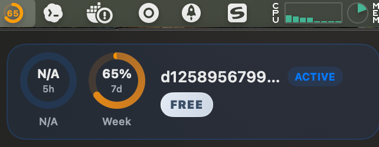
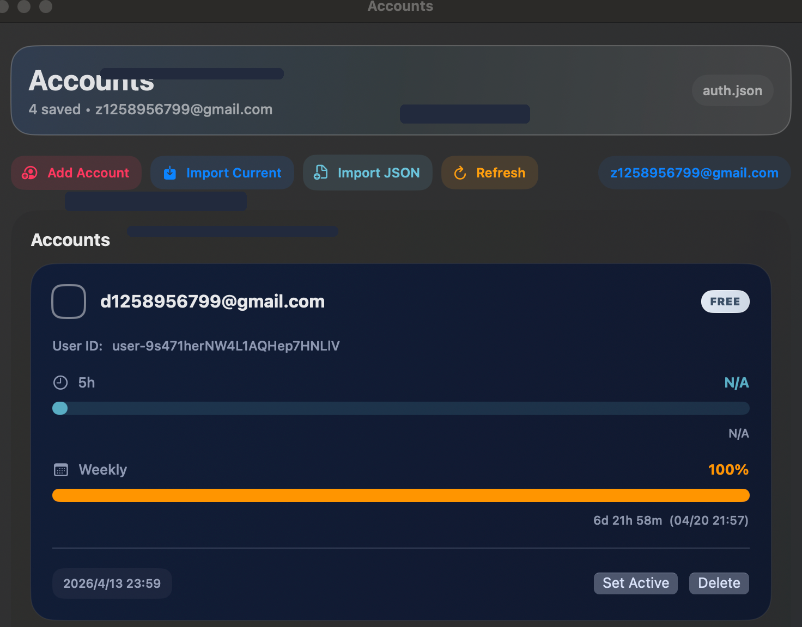

# ccSwitch

[](LICENSE)


[](https://github.com/eiis/ccSwitch/releases)
[](https://github.com/eiis/ccSwitch/releases)

Lightweight macOS menu bar account switcher for Codex / ChatGPT, with local auth management and usage-aware switching.

[中文](README.zh.md) · [Download](https://github.com/eiis/ccSwitch/releases) · [Feedback](https://github.com/eiis/ccSwitch/issues)

* * *

## Screenshots

| Menu Bar | Account Manager |
|:---:|:---:|
|  |  |

### Live Menu Bar Usage


* * *

## ✨ Features

- Multi-account switching — Save multiple Codex / ChatGPT accounts locally and switch with one click
- Usage visibility — Inspect 5-hour and 7-day usage windows for each account, including reset times
- Live menu bar status — Show the current account's live usage ring and numeric status directly in the menu bar
- Simplified account manager — Review account identity, usage progress, reset timing, and actions in a cleaner management view
- Auto fallback — Automatically switches away from the current account when usage is exhausted
- Safe manual switching — Pre-checks target account usage before applying the switch
- Local-first — Reads and writes `~/.codex/auth.json` directly, with no third-party sync
- Menu bar workflow — Fast access from the menu bar, plus a larger account management window

* * *

## Installation

### Direct Download

Download the latest `ccSwitch-macos-unsigned.dmg` from the [Releases](https://github.com/eiis/ccSwitch/releases) page, open it, and drag `ccSwitch.app` into `/Applications`.

Because this build is distributed without an Apple Developer account:

- it is ad-hoc signed
- it is not notarized
- macOS may warn on first launch

If macOS blocks the app, right-click `ccSwitch.app` and choose `Open`.

If Gatekeeper quarantine still prevents launch, run:

```bash
xattr -dr com.apple.quarantine /Applications/ccSwitch.app
```

### Build from Source

```bash
git clone https://github.com/eiis/ccSwitch.git
cd ccSwitch
swift build
swift run ccSwitchboardMac
```

> Requirements: macOS 13.0 or later. Xcode Command Line Tools or full Xcode is required only for building from source.

* * *

## Usage

- Import Current Auth: import the account currently stored in `~/.codex/auth.json`
- Add OpenAI Account: add another account through browser-based OpenAI login
- Set Active: switch the local Codex auth to the selected saved account
- Refresh: update all account usage information immediately

Manual switching behavior:

- The app refreshes the target account usage before switching
- If the target account is already exhausted, the switch is blocked
- If the active account later becomes exhausted and another usable account exists, the app can auto-switch

* * *

## How It Works

`ccSwitch` stores imported account metadata locally, then swaps the active account by rewriting `~/.codex/auth.json`. Usage information is fetched from the ChatGPT usage API using each account's local auth token and account ID.

The app does not proxy requests, host credentials remotely, or modify Codex itself. It only manages local auth state on your Mac.

* * *

## Project Structure

```text
Sources/ccSwitchboardMac/
├── App/                         # App lifecycle and state management
├── Core/
│   ├── Auth/                    # auth.json parsing, normalization, OAuth login
│   ├── Storage/                 # local account persistence
│   └── Usage/                   # usage API fetching and interpretation
├── Features/
│   ├── Accounts/                # account manager window UI
│   └── MenuBar/                 # menu bar dropdown UI
└── Shared/                      # shared models, badges, icon rendering

scripts/package_release.sh       # builds release .app bundle and dmg
```

* * *

## Packaging

To build a distributable release bundle locally:

```bash
./scripts/package_release.sh
```

This packaging step also regenerates the app icon set and `AppIcon.icns`, so the shipped bundle uses the current macOS-style app tile proportions.

Output:

- `dist/ccSwitch.app`
- `dist/ccSwitch-macos-unsigned.dmg`

* * *

## Limitations

- The app controls local `auth.json`; it does not guarantee a running Codex process will reload credentials immediately
- Automatic switching depends on the latest fetched usage data
- Without notarization, first-launch friction on macOS is expected

* * *

## License

[MIT](LICENSE) © 2026 eiis
